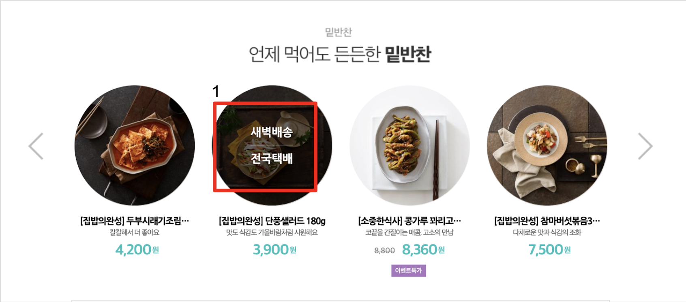

# Today Log

오늘은 11시 반쯤에 코드스쿼드에 왔다… 늦게 왔다...

오늘 개발한 거는 크롱에게 리뷰받은 메인슬라이드에 대해서 수정을 했다.

### 메인슬라이드를 구현하면서 고민했던 점

1. 컨텐츠가 6개있다고 해서 li를 6개 쓰는 게 맞나?

2. 이전컨텐츠버튼과 다음컨텐츠버튼을 눌렀을 때 비슷한 코드가 많다?

3. 바로 밑에 서브슬라이드가 있는데 애니메이션 효과만 다르고 비슷하다?

4. view끼리 상호작용이 너무 많다?

이런 고민이 들었다.

### 바꾼점

1. li태그를 3개로 고정시켜놓고 li태그의 위치를 이동시키면서 슬라이드기능구현

2. 비슷한 코드가 많지만 동작이 완전 반대라 방법은 찾지 못했다. 더 고민하는 걸로
3. 메인슬라이드와 서브슬라이드는 같은 클래스를 재사용해서 구현하였다. 다른점은 애니메이션 효과였는데 그건 css로 차별성을 두었다. 밑에 있는 listSlide는 재사용하고는 싶은데 잘될진 모르겠다..
4. view끼리 상호작용이 많아서 view끼리 의존하지 않게끔 했고 그 view들을 이어주는 controller를 두었다.

# 잘한점

1. 블로그를 쓰기 잘했다.
2. 메인클래스와 서브클래스 같이 쓴거 좋았다.
3. 코드를 이렇게도 구현해보고 저렇게 구현해보고 결국 제자리였지만 여러가지 시도를 해서 부딪힌게 좋았다고 위안을 삼아야겠다.

# 못한점

1. 더 잘짜야된다.
2. 창의적인 생각을 해야한다.
3. 프로젝트 진도 속도가 너무 느리다 더 빨리하자! ( 삽질을 많이했다. 이리저리 많이 시도했지만 제자리.. )

# 내일할일

( 주의할점 : 순서대로 클리어하기 1번끝나면 2번하고 2번끝나면 3번하기 )

1. 코드스쿼드 10시30분까지 도착하기!

2. listSlide구현하기위해 html, css짜기

3. Content에 마우스올렸을 때 Content UI 변하는 것 까지 빨리끝내기

4. listSlide 슬라이드 기능빨리하기. 

   4-1 템플릿 먼저 하기

   4-2 reduce를 사용하여 새로운 데이터 만들기

